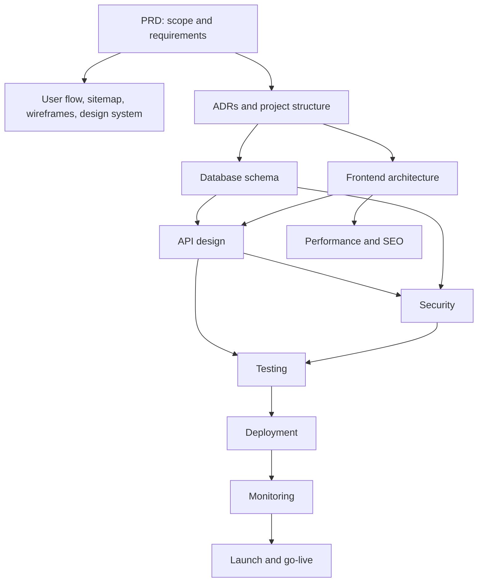

# Master Architecture

## Purpose

This is a navigation summary, not a replacement for the detailed source documents. The detailed documents listed below remain authoritative for their subjects.

## System Overview and Layers

VERTEXworkout is a monorepo-based fitness ecosystem. Its defined layers are presentation (Next.js application and shared UI), feature/domain use cases (`packages/api`), data access (`packages/database`), authentication/authorization, validation, shared libraries, and Supabase-backed persistence. The definitive structure is [architecture/project-structure.md](architecture/project-structure.md).

## Technology Stack and Major Decisions

The approved stack and five recorded architectural decisions are consolidated in [adr/ADRs.md](adr/ADRs.md). Detailed frontend implementation boundaries are in [frontend/](frontend/), while the database model is in [database/schema.md](database/schema.md).

## Dependency Graph

## Data, Security, Deployment, Monitoring, and Testing

Data model: [database/schema.md](database/schema.md). API contracts and integration boundaries: [api/](api/). Security controls: [security/](security/). Deployment lifecycle: [deployment/deployment-strategy.md](deployment/deployment-strategy.md). Observability: [monitoring/](monitoring/). Test strategy: [testing/](testing/). These documents own the operational detail and must not be duplicated here.

## Scope, Future Phases, and Readiness

Current and future scope are defined by [PRD.md](PRD.md). The documentation strategy is in [documentation/](documentation/). Four findings and their source references are tracked in [ARCHITECTURE_REVIEW.md](ARCHITECTURE_REVIEW.md); readiness is assessed in [PRODUCTION_READINESS_REPORT.md](PRODUCTION_READINESS_REPORT.md).
