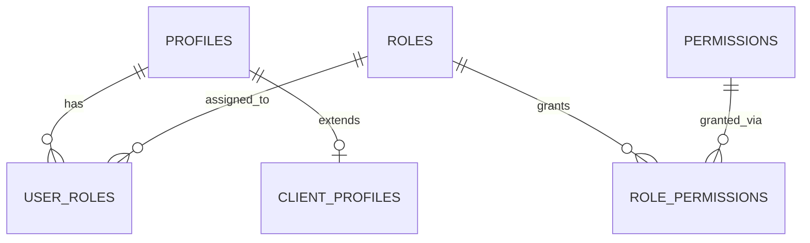
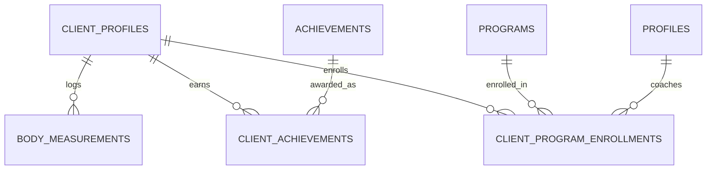
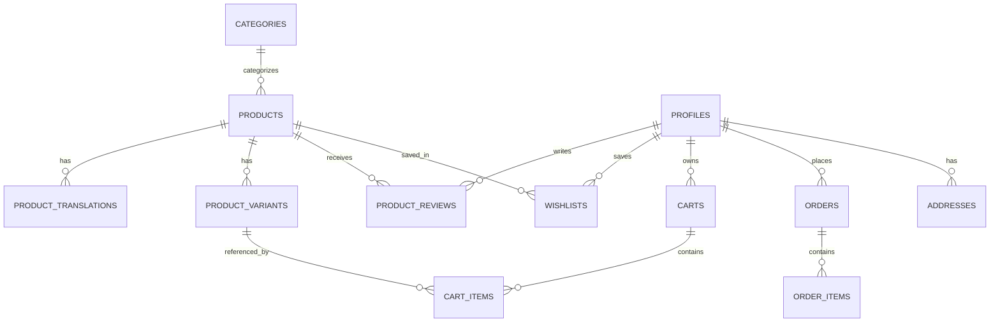
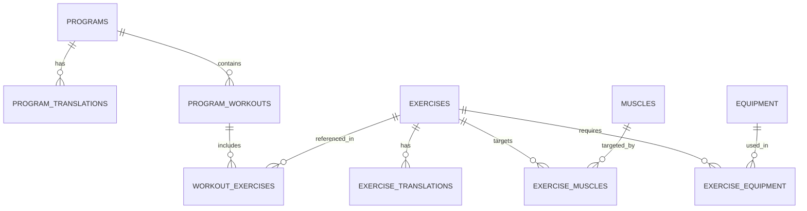
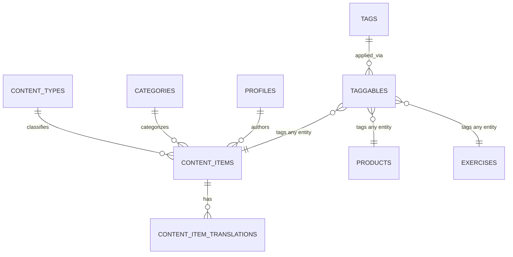
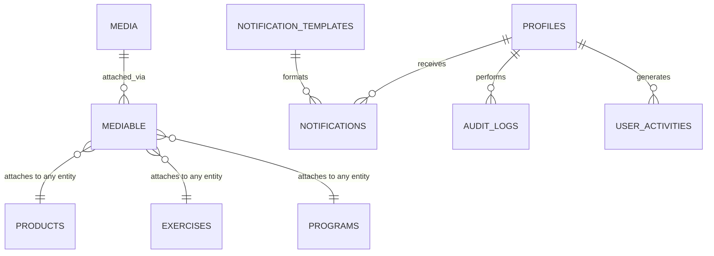

# Database Schema — VERTEXworkout
**المرحلة 2 من 18 — Database Architecture Documentation**
**الإصدار:** 1.0 — PostgreSQL (عبر Supabase)

---

## 1. المعايير والقواعد العامة (Conventions)

| المعيار | القاعدة المتبعة |
|---|---|
| المفتاح الأساسي | `UUID` (v4) لكل الجداول — لا يوجد Auto Increment إطلاقًا |
| تسمية الجداول | جمع + snake_case، مثال: `products`, `client_profiles` |
| تسمية الأعمدة | snake_case بالكامل |
| المفاتيح الأجنبية | `entity_id`، مثال: `product_id`, `category_id`, `user_id` |
| الحقول القياسية | `id`, `created_at`, `updated_at`, `deleted_at`, `created_by`, `updated_by` في كل جدول (باستثناء جداول Pivot النقية — موضّح في القسم 2) |
| التطبيع | حتى 3NF كحد أدنى — حالات الاستثناء (Denormalization) موضّحة صراحة في القسم 9 |
| قاعدة البيانات | PostgreSQL 15+ عبر Supabase، مع الاستفادة من: `UUID`, `JSONB`, `tsvector` (Full-text Search), `Row Level Security` |

**لماذا UUID لا Auto Increment؟**
- لا يكشف عدد السجلات (Security by Obscurity إضافية).
- يسمح بتوليد المعرّف من طرف العميل (Client-side) قبل الحفظ — مفيد جدًا للعمليات غير المتصلة (Offline-first) في تطبيق الموبايل مستقبلاً.
- يسهّل الدمج بين قواعد بيانات متعددة مستقبلاً (لو احتجنا Sharding أو Replication) بدون تعارض مفاتيح.

---

## 2. سياسة Soft Delete

| النوع | القرار | مثال |
|---|---|---|
| **جداول المحتوى الأساسية** (تحتاج استعادة محتملة) | ✅ Soft Delete (`deleted_at`) | `products`, `programs`, `exercises`, `content_items`, `categories`, `media`, `client_profiles` |
| **جداول Pivot/العلاقات النقية** (لا معنى لاستعادتها) | ❌ Hard Delete | `role_permissions`, `user_roles`, `exercise_muscles`, `exercise_equipment`, `taggables`, `mediable`, `cart_items` |
| **السجلات المالية/التدقيقية** (يجب أن تبقى ثابتة تاريخيًا) | ❌ لا حذف نهائيًا — تُستخدم حالة (Status) بدلاً من الحذف | `orders`, `order_items`, `audit_logs` |
| **الإشعارات** (بيانات مؤقتة قصيرة العمر) | ❌ Hard Delete بعد فترة أرشفة (Retention Policy) | `notifications` |

كل الجداول ذات Soft Delete تحصل تلقائيًا على **Partial Index** على `WHERE deleted_at IS NULL` (تفاصيل القسم 8).

---

## 3. نظام الأدوار والصلاحيات (RBAC)

```
roles                  permissions              role_permissions
├── id (uuid)          ├── id (uuid)             ├── role_id → roles.id
├── code (unique)      ├── code (unique)          ├── permission_id → permissions.id
├── name_translations  ├── description
└── description        └── module (store/academy/admin...)

user_roles
├── user_id → profiles.id
└── role_id → roles.id
```

- علاقة **Many-to-Many** بين `profiles` و`roles` عبر `user_roles` — يسمح لمستخدم واحد بأكثر من دور (مثلاً Coach يكون أيضًا Admin).
- `permissions` مرتبطة بـ `roles` عبر `role_permissions` — إضافة صلاحية جديدة أو دور جديد = **إدراج صفوف فقط، بدون أي تعديل هيكلي (Schema Migration)**.
- الأدوار الأساسية عند الإطلاق: `admin`, `coach`, `client` — مُدرجة كبيانات أولية (Seed) وليست Hardcoded في الكود.

---

## 4. استراتيجية المحتوى متعدد اللغات (i18n Pattern)

**النمط المتّبع:** كل جدول يحتوي بيانات قابلة للترجمة يُقسّم إلى جدولين:
- الجدول الأساسي: يحمل البيانات غير القابلة للترجمة (السعر، المخزون، التواريخ، الوسائط، الحالة).
- جدول `_translations`: يحمل الحقول النصية فقط لكل لغة، بقيد `UNIQUE(entity_id, locale)`.

مثال — `products` و `product_translations`:
```
products                          product_translations
├── id (uuid)                     ├── id (uuid)
├── sku (unique)                  ├── product_id → products.id
├── category_id → categories.id   ├── locale ('ar' | 'en' | ...)
├── price                         ├── name
├── stock_quantity                ├── description
├── is_published                  └── UNIQUE(product_id, locale)
└── ...
```

**الفائدة:** إضافة لغة ثالثة مستقبلاً (فرنسي مثلاً) = **صف جديد في جدول الترجمة فقط**، بدون أي تعديل على الجداول الأساسية أو الكود المصاحب لها.

الجداول المطبَّق عليها هذا النمط: `products`, `programs`, `exercises`, `content_items`, `categories`, `tags`, `muscles`, `equipment`, `achievements`.

---

## 5. نظام إدارة الوسائط (Media Management) — Polymorphic

```
media                              mediable
├── id (uuid)                      ├── media_id → media.id
├── url                             ├── mediable_type ('product'|'exercise'|'program'|'profile'|...)
├── type ('image'|'video'|'doc')   ├── mediable_id (uuid)
├── mime_type                       ├── role ('cover'|'gallery'|'video'|'avatar')
├── size_bytes                      └── order_index
├── alt_text
└── uploaded_by → profiles.id
```

**لماذا Polymorphic بدل عمود `image_url` في كل جدول؟**
- كيان واحد (منتج، تمرين، برنامج) قد يحتاج أكثر من ملف وسائط (صورة غلاف + معرض صور + فيديو) — عمود واحد لا يكفي.
- إضافة كيان جديد يحتاج وسائط مستقبلاً (مثل `booking_slots` بصورة موقع) لا يتطلب أي عمود جديد — فقط سجل جديد في `mediable`.
- إدارة مركزية لكل الملفات (حذف، ضغط، CDN) من مكان واحد.

---

## 6. الوسوم والتصنيفات العامة (Tags & Categories) — عبر النظام بالكامل

```
categories (شجرية عبر parent_id)      tags                    taggables
├── id                                 ├── id                  ├── tag_id → tags.id
├── parent_id → categories.id (nullable) ├── slug (unique)      ├── taggable_type
├── type ('product'|'academy'|'blog'|'exercise') ├── ...        ├── taggable_id
├── slug (unique)                                               
category_translations                 tag_translations
├── category_id, locale, name                   ├── tag_id, locale, name
```

- `categories` جدول **واحد عام** يُستخدم لتصنيف المنتجات، مقالات الأكاديمية، المدونة، والتمارين — مع عمود `type` للتمييز، وعلاقة `parent_id` لدعم تصنيفات فرعية (مثال: Academy → Nutrition → Meal Planning).
- `tags` + `taggables` (Polymorphic) يسمحان بوسم **أي كيان** (منتج، مقال، تمرين، برنامج) بنفس آلية الوسوم، ويُستخدمان لاحقًا في بناء ميزة "المحتوى ذو الصلة" والبحث والفلترة.

---

## 7. سجلات التدقيق والنشاط (Audit Logs & Activity Timeline)

نُفرّق بين نوعين مختلفين تمامًا في الغرض:

| | `audit_logs` | `user_activities` |
|---|---|---|
| **الغرض** | أمني/تدقيقي — لمن يفعل ماذا في لوحة التحكم | تفاعلي/عرضي — خط زمني لأنشطة المستخدم الشخصية |
| **الجمهور** | Admin فقط | المستخدم نفسه (وربما مدربه) |
| **مثال** | "الأدمن X عدّل سعر المنتج Y من 100 إلى 120" | "أكملت تمرين الضغط اليوم"، "حصلت على وسام Beast Mode" |
| **الحذف** | لا يُحذف أبدًا (Immutable) | يمكن أرشفته بعد فترة |

```
audit_logs                              user_activities
├── id, actor_id → profiles.id           ├── id, user_id → profiles.id
├── action ('create'|'update'|'delete')  ├── activity_type
├── entity_type, entity_id               ├── description
├── old_values (jsonb)                   ├── metadata (jsonb)
├── new_values (jsonb)                   └── created_at
├── ip_address, user_agent
└── created_at
```

---

## 8. نظام الإشعارات (Notifications) — متعدد القنوات

```
notification_templates          notifications                    notification_preferences
├── id, code (unique)           ├── id, user_id → profiles.id     ├── user_id → profiles.id
├── channel                     ├── template_id → notification_templates.id  ├── channel
└── translations                ├── channel ('email'|'push'|'in_app'|'sms')  └── is_enabled
                                 ├── title, body, data (jsonb)
                                 ├── is_read, sent_at, read_at
                                 └── status ('pending'|'sent'|'failed')
```

- عمود `channel` يجعل إضافة قناة جديدة (SMS مستقبلاً) مجرد **قيمة جديدة في enum**، بدون تعديل هيكلي.
- `notification_templates` يفصل "شكل الرسالة" عن "سجل الإرسال الفعلي" — يسمح بتعديل نصوص القوالب دون المساس بالسجلات القديمة.

---

## 9. حالات التطبيع والاستثناءات المدروسة (Normalization & Denormalization)

القاعدة مُطبَّعة حتى **3NF** عبر: فصل الترجمات، تعميم الوسائط، تعميم التصنيفات/الوسوم، وفصل الـ RBAC عن الملفات الشخصية.

**استثناءات Denormalization متعمّدة (لأسباب أداء أو تكامل تاريخي):**

| الجدول | الحقل المُكرَّر | السبب |
|---|---|---|
| `order_items` | `product_name`, `unit_price` (نسخة وقت الشراء) | حماية السجل التاريخي — لو تغيّر اسم/سعر المنتج لاحقًا، يجب أن تبقى الفاتورة القديمة كما كانت وقت الشراء |
| `products` | `average_rating`, `reviews_count` | تجنّب حساب المتوسط من `product_reviews` في كل تحميل صفحة — يُحدَّث عبر Trigger/Job عند إضافة مراجعة جديدة |
| `content_items` | `view_count` | عداد تراكمي بسيط أسرع بكثير من عدّ سجلات أحداث منفصلة في كل طلب |

---

## 10. مخطط العلاقات (ERD) — Mermaid Diagrams

### أ. الهوية والصلاحيات (Identity & RBAC)


### ب. المتدرب والتقدّم (Client & Progress)


### ج. المتجر (Store)


### د. البرامج ومكتبة التمارين (Programs & Exercise Library)


### هـ. الأكاديمية والمحتوى العام + الوسوم (Academy/Content & Tags)


### و. الوسائط، الإشعارات، والتدقيق (Media, Notifications, Audit)


---

## 11. جدول مرجعي شامل لكل جدول (Table Reference Guide)

| الجدول | الوظيفة | العلاقات الرئيسية | لماذا بهذا التصميم |
|---|---|---|---|
| `profiles` | الملف الشخصي الأساسي لكل مستخدم (يمتد من `auth.users` في Supabase) | 1-1 مع `client_profiles`، N-N مع `roles` | مصدر واحد للهوية عبر كل النظام |
| `roles` / `permissions` / `role_permissions` / `user_roles` | نظام RBAC كامل | موضّح بالقسم 3 | مرونة إضافة أدوار دون تعديل هيكلي |
| `client_profiles` | بيانات المتدرب الموسّعة (طول، وزن، هدف) | 1-1 مع `profiles` | فصل بيانات "الأدوار الخاصة" عن الملف العام لتفادي أعمدة فارغة لغير المتدربين |
| `body_measurements` | سجل قياسات جسدية عبر الزمن | N-1 مع `client_profiles` | جدول منفصل لأنها بيانات متكررة زمنيًا (Time-series) وليست حقلاً واحدًا |
| `achievements` / `client_achievements` | نظام الإنجازات والأوسمة | N-N بين المتدربين والإنجازات | يسمح بإضافة إنجازات جديدة كبيانات فقط |
| `client_program_enrollments` | ربط المتدرب بالبرامج المشترك فيها + تقدّمه | N-1 مع `client_profiles`, `programs`, `profiles` (كمدرب) | يمثل "حالة اشتراك" منفصلة عن تعريف البرنامج نفسه |
| `categories` / `category_translations` | تصنيف عام قابل لإعادة الاستخدام عبر كل النظام | شجرية عبر `parent_id` | تفادي تكرار جدول تصنيف منفصل لكل نوع محتوى |
| `products` / `product_translations` / `product_variants` | كتالوج المنتجات (VERTEX Power Bags, Resistance Bands...) | N-1 مع `categories` | فصل الترجمة، ودعم المتغيرات (مقاس/لون) عبر `product_variants` |
| `product_reviews` / `wishlists` | تفاعل العملاء مع المنتجات | N-1 مع `products`, `profiles` | جاهزة بنيويًا حتى لو غير مفعّلة بالواجهة في MVP |
| `carts` / `cart_items` | سلة التسوق | 1-N | منفصلة عن `orders` لأن السلة حالة مؤقتة قابلة للتعديل باستمرار |
| `orders` / `order_items` | الطلبات المؤكدة | 1-N، بيانات مُجمَّدة وقت الشراء | لا Soft Delete — سجل مالي يجب أن يبقى ثابتًا |
| `addresses` | عناوين الشحن | N-1 مع `profiles` | يدعم عناوين متعددة لكل مستخدم |
| `programs` / `program_translations` / `program_workouts` / `workout_exercises` | البرامج التدريبية وتفاصيل التمارين اليومية | هرمي: برنامج ← أيام ← تمارين | يسمح ببناء برنامج مرن بأي عدد أيام/تمارين |
| `exercises` / `exercise_translations` | مكتبة التمارين | N-N مع `muscles`, `equipment` | تفصيل كامل حسب طلبك (فيديو، صعوبة، عضلات...) |
| `muscles` / `equipment` (+ translations) | بيانات مرجعية لتصنيف التمارين | N-N مع `exercises` | تُستخدم في الفلترة والبحث بمكتبة التمارين |
| `content_types` / `content_items` / `content_item_translations` | نظام عام يغطي المدونة + VERTEX Academy + Smart Cards | مرن عبر `type` | تفادي تكرار جدول منفصل لكل نوع محتوى نصّي |
| `tags` / `taggables` | وسوم عامة قابلة للربط بأي كيان | Polymorphic N-N | بحث وفلترة موحّدة عبر كل النظام |
| `media` / `mediable` | إدارة الوسائط المركزية | Polymorphic N-N | ملف واحد قابل للربط بأي عدد من الكيانات |
| `notification_templates` / `notifications` / `notification_preferences` | نظام إشعارات متعدد القنوات | N-1 مع `profiles` | جاهز لإضافة SMS مستقبلاً دون تعديل هيكلي |
| `audit_logs` | تتبع أمني/تدقيقي لعمليات لوحة التحكم | N-1 مع `profiles` (كمُنفّذ) | Immutable — لا يُعدَّل ولا يُحذف أبدًا |
| `user_activities` | خط زمني لأنشطة المستخدم الشخصية | N-1 مع `profiles` | منفصل عن `audit_logs` لاختلاف الغرض والجمهور |
| `booking_slots` / `bookings` | حجز جلسات تدريب (Phase 2) | N-1 مع `profiles` (كمدرب وكعميل) | مصمّم الآن ليُفعّل لاحقًا دون تعديل هيكلي |

---

## 12. الفهارس (Indexes) وأسبابها

| الفهرس | على الجدول | السبب |
|---|---|---|
| `UNIQUE INDEX` على `slug` | `products`, `programs`, `exercises`, `content_items`, `categories`, `tags` | لضمان روابط URL فريدة وسريعة البحث (`WHERE slug = ?`) |
| `UNIQUE INDEX` على `(entity_id, locale)` | كل جداول `_translations` | منع تكرار نفس اللغة لنفس السجل، وتسريع جلب الترجمة المحدّدة |
| `PARTIAL INDEX` على `WHERE deleted_at IS NULL` | كل الجداول ذات Soft Delete | أغلب الاستعلامات تبحث فقط عن السجلات النشطة — فهرس جزئي أخف وأسرع من فهرس كامل |
| `COMPOSITE INDEX` على `(taggable_type, taggable_id)` | `taggables` | تسريع "أعطني كل الوسوم لهذا الكيان" في الاتجاهين |
| `COMPOSITE INDEX` على `(mediable_type, mediable_id)` | `mediable` | نفس المنطق لجلب وسائط أي كيان بسرعة |
| `COMPOSITE INDEX` على `(user_id, placed_at DESC)` | `orders` | تسريع صفحة "طلباتي" مرتبة بالأحدث |
| `COMPOSITE INDEX` على `(user_id, is_read)` | `notifications` | تسريع عدّاد الإشعارات غير المقروءة |
| `COMPOSITE INDEX` على `(entity_type, entity_id)` + `created_at` | `audit_logs` | تسريع "سجل تعديلات هذا السجل" وتقارير زمنية |
| `GIN INDEX` على أعمدة `jsonb` (`data`, `old_values`, `new_values`, `metadata`) | `notifications`, `audit_logs`, `user_activities` | يسمح بالبحث داخل محتوى JSON بكفاءة |
| `GIN INDEX` على `tsvector` (Full-text Search) | `product_translations(name, description)`, `content_item_translations(title, body)`, `exercise_translations(name, description)` | يدعم البحث النصي السريع المطلوب عبر النظام بالكامل (نقطة 13 من متطلباتك) |
| `INDEX` على كل عمود `_id` (مفتاح أجنبي) | جميع الجداول | ممارسة أساسية في PostgreSQL — بدون هذا، أي `JOIN` يتحول لـ Full Table Scan |

---

## ✅ يرجى المراجعة والموافقة على:
- [ ] المعايير العامة (UUID, snake_case, الحقول القياسية)
- [ ] سياسة Soft Delete الموزّعة حسب نوع الجدول
- [ ] تصميم RBAC (roles/permissions/role_permissions/user_roles)
- [ ] نمط الترجمة (`_translations` tables)
- [ ] نظام الوسائط الموحّد (Polymorphic media/mediable)
- [ ] نظام Tags/Categories العام
- [ ] الفصل بين `audit_logs` و`user_activities`
- [ ] نظام الإشعارات متعدد القنوات
- [ ] حالات Denormalization المذكورة وتبريرها
- [ ] مخططات ERD والجدول المرجعي الكامل
- [ ] الفهارس المقترحة

بعد الموافقة، ننتقل مباشرة إلى **المرحلة 3: User Flow**.

**ملاحظة:** لم تتم كتابة أي SQL أو Migration بعد — هذا تصميم مفاهيمي بانتظار اعتمادك الكامل، تمامًا كما طلبت.
