# User Flow — VERTEXworkout
**المرحلة 3 من 18 — UX Flow Documentation**
**الإصدار:** 1.0

---

## 0. مبادئ UX المتّبعة عبر كل الوثيقة

- **Progressive Disclosure:** لا نعرض للمستخدم إلا ما يحتاجه في كل خطوة، مع تأجيل التعقيد لمن يريده فعلاً.
- **Fail Gracefully:** كل نقطة فشل محتملة (دفع، تحقق، شبكة) لها مسار واضح للعودة والمحاولة، وليست طريقًا مسدودًا.
- **Guest-First حيث ممكن:** تصفح المتجر والمكتبة والأكاديمية لا يتطلب تسجيل دخول إجباري — التسجيل يُطلب فقط عند نقطة القيمة الحقيقية (الدفع، حفظ التقدم).
- **Consistency عبر الأدوار:** نفس مكونات الحالة (Loading/Error/Empty/Success) تُستخدم في كل الأدوار (Visitor/Client/Coach/Admin) لتقليل الحمل المعرفي.
- **RTL-First:** كل رحلة مصمّمة لتعمل بنفس الجودة بالعربية (RTL) والإنجليزية (LTR) دون أي فرق في التجربة.

---

## 1. رحلة كل نوع مستخدم (User Journeys by Persona)

### أ. الزائر (Visitor)
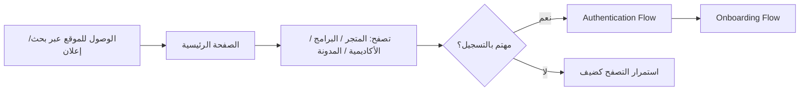

### ب. المتدرب (Client)
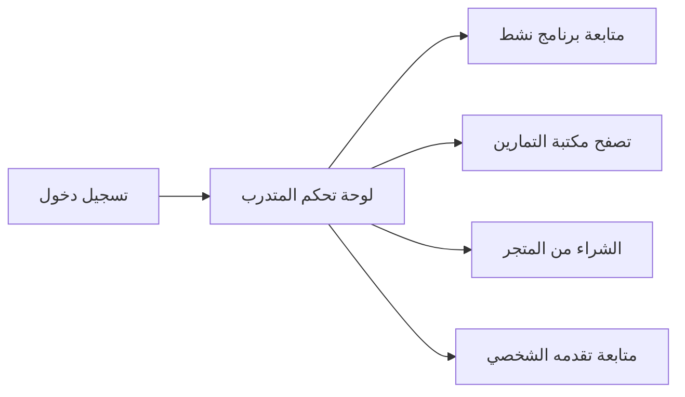

### ج. المدرب (Coach) — Phase 3
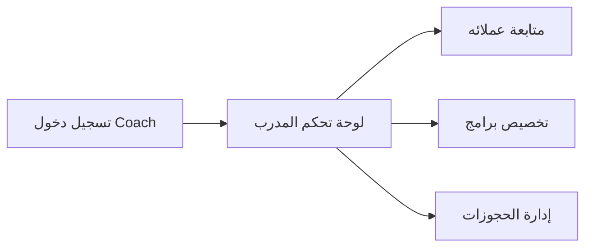

### د. الأدمن (Admin) — Phase 3
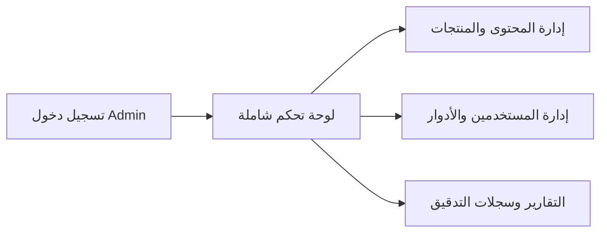

---

## 2. تدفق المصادقة (Authentication Flow)

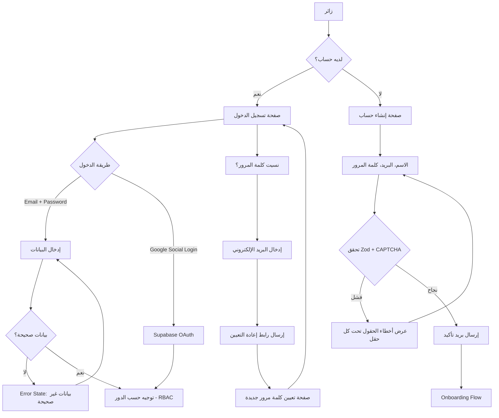

**أفضل ممارسات UX مُطبَّقة:**
- رسائل الخطأ **تحت كل حقل مباشرة**، وليست رسالة عامة أعلى الفورم (تقليل زمن اكتشاف الخطأ).
- زر "نسيت كلمة المرور" ظاهر دائمًا بجانب حقل كلمة المرور، وليس مخفيًا.
- CAPTCHA يظهر فقط عند الاشتباه (بعد محاولة فاشلة أو سلوك مشبوه) وليس في كل مرة — تقليل الاحتكاك.

---

## 3. تدفق الإعداد الأولي (Onboarding Flow)

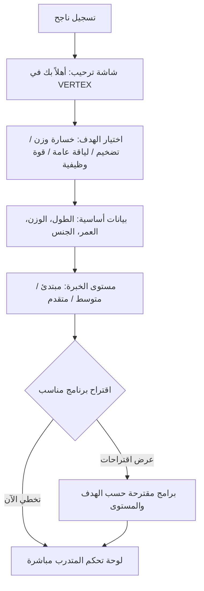

**ملاحظة UX:** كل خطوة قابلة للتخطي (Skip) ما عدا البيانات الأساسية — نحترم وقت المستخدم ولا نفرض عليه رحلة طويلة إجبارية قبل الوصول للمنصة.

---

## 4. تدفق شراء من المتجر (Store Purchase Flow)

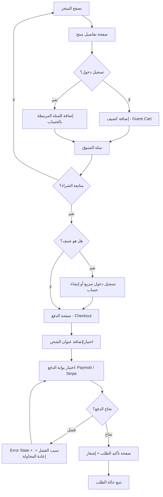

**ملاحظة UX:** سلة الضيف (Guest Cart) تُحفظ محليًا وتُدمج تلقائيًا مع حساب المستخدم بمجرد تسجيل الدخول — لا يفقد المستخدم اختياراته أبدًا.

---

## 5. تدفق الاشتراك في برنامج تدريبي (Program Enrollment Flow)

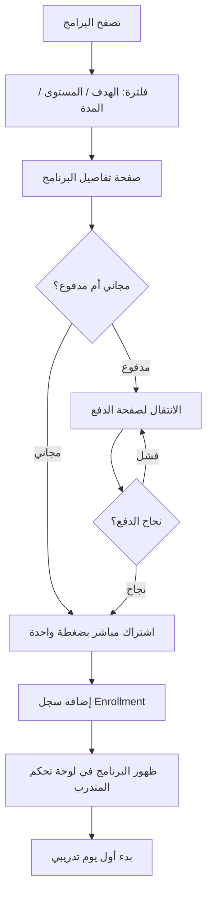

---

## 6. تدفق مكتبة التمارين (Exercise Library Flow)

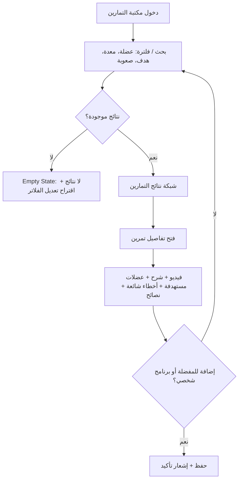

---

## 7. تدفق VERTEX Academy

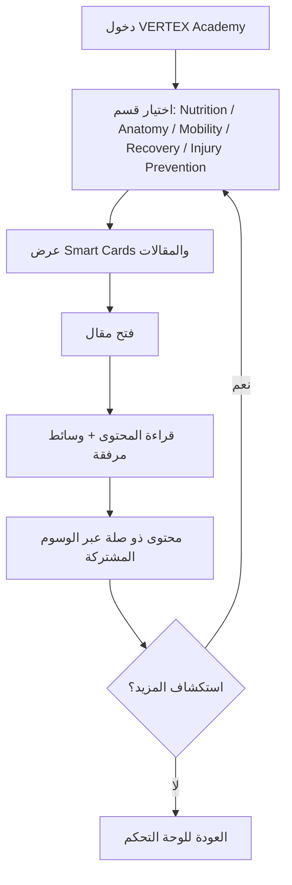

---

## 8. تدفق لوحة تحكم المتدرب (Client Dashboard Flow)

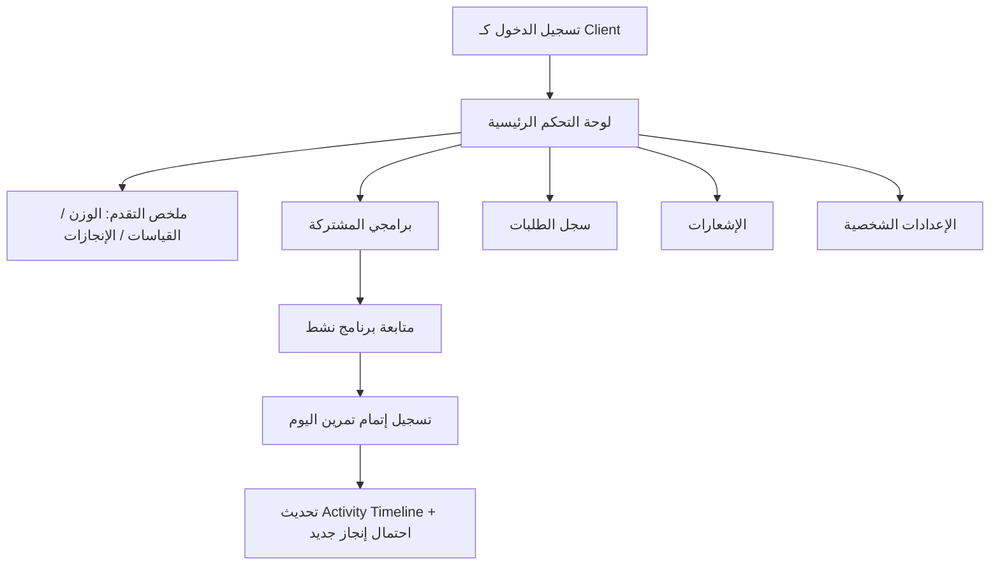

---

## 9. تدفق لوحة تحكم المدرب (Coach Dashboard Flow) — Phase 3

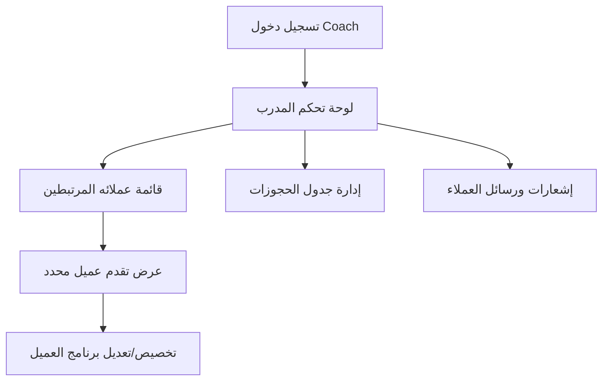

---

## 10. تدفق لوحة تحكم الأدمن (Admin Dashboard Flow) — Phase 3

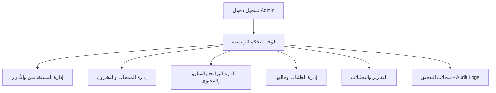

---

## 11. تدفق الصلاحيات (Permission Flow — RBAC)

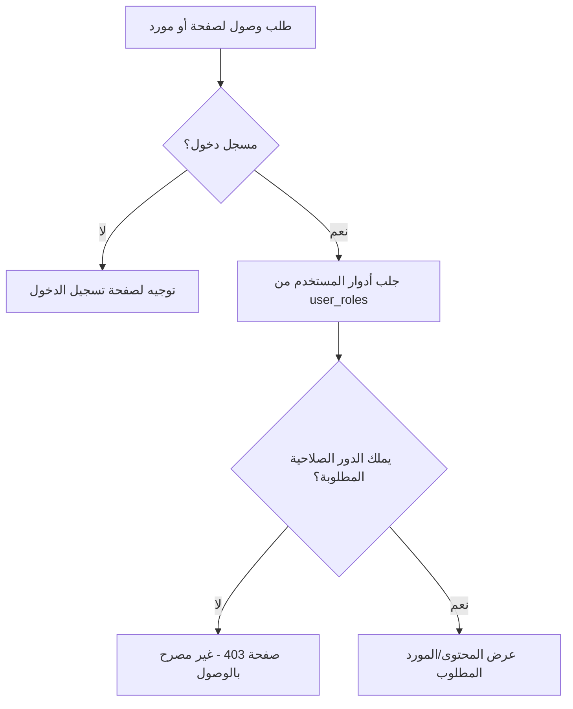

**ملاحظة تصميمية:** يتم التحقق من الصلاحيات على مستويين: **Middleware** (منع الوصول للمسار كليًا) و**مكوّن الواجهة** (إخفاء أزرار/إجراءات لا يملك المستخدم صلاحيتها) — حماية مزدوجة (Defense in Depth).

---

## 12. تدفق تعدد اللغات (Multi-language Flow)

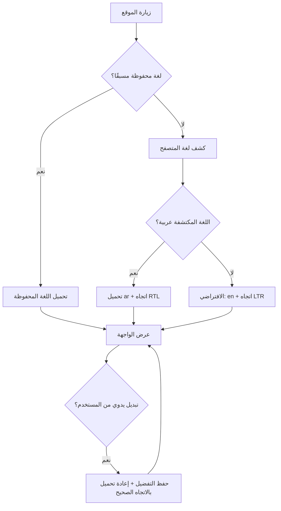

---

## 13. الحالات العامة عبر كل الواجهات (Global UI States)

كل مكوّن يجلب بيانات في المنصة (منتج، تمرين، برنامج، إشعارات...) يمر بنفس دورة الحالات الأربع:

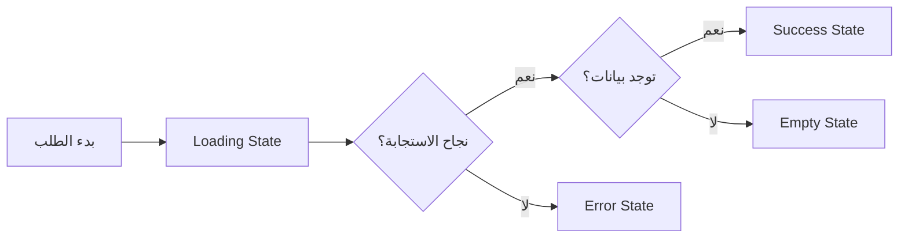

| الحالة | أفضل الممارسات المتبعة |
|---|---|
| **Loading** | Skeleton Screens (وليس Spinner فقط) تحاكي شكل المحتوى الفعلي — تقلل الإحساس بزمن الانتظار |
| **Empty** | رسالة ودّية + توضيح السبب + إجراء مقترح (مثال: "لا توجد منتجات بهذا الفلتر، جرّب تعديل البحث") — ليست شاشة فارغة بلا سياق |
| **Error** | رسالة واضحة بلغة الإنسان (لا رموز أخطاء تقنية) + زر "إعادة المحاولة" دائمًا متاح |
| **Success** | تأكيد بصري فوري (Toast/Checkmark) + خطوة تالية واضحة (مثال: بعد الشراء، زر "تتبع الطلب") |

---

## 14. الفروقات بين تجربة الموبايل والديسكتوب

| العنصر | Desktop | Mobile |
|---|---|---|
| التنقل الرئيسي | Header أفقي ثابت مع كل الأقسام ظاهرة | Bottom Navigation Bar (الرئيسية، المتجر، الأكاديمية، حسابي) |
| الفلاتر (مكتبة التمارين/المتجر) | Sidebar جانبي دائم الظهور | Bottom Sheet قابل للسحب لأعلى |
| تفاصيل المنتج/التمرين | عرض جنبًا إلى جنب (صورة + تفاصيل) | عرض عمودي متتابع (Scroll) |
| لوحة التحكم | Sidebar ثابت + محتوى رئيسي | قائمة منسدلة (Hamburger) + محتوى ملء الشاشة |
| الفيديوهات (Exercise Library) | تشغيل داخل الصفحة (Inline) | تشغيل ملء الشاشة تلقائيًا عند الضغط |

كل الرحلات المذكورة أعلاه **مصمَّمة لتعمل بنفس المنطق على كلا الجهازين**، مع اختلاف فقط في طريقة عرض التنقل والتفاعل، وليس في تسلسل الخطوات نفسه.

---

## ✅ يرجى المراجعة والموافقة على:
- [ ] رحلات الأدوار الأربعة (Visitor/Client/Coach/Admin)
- [ ] تدفق المصادقة (Login/Register/Forgot Password/Social Login)
- [ ] تدفق Onboarding
- [ ] تدفق الشراء وتدفق الاشتراك في البرامج
- [ ] تدفق مكتبة التمارين وVERTEX Academy
- [ ] تدفقات لوحات التحكم الثلاث
- [ ] تدفق الصلاحيات (RBAC) وتدفق تعدد اللغات
- [ ] الحالات العامة (Loading/Empty/Error/Success)
- [ ] الفروقات بين الموبايل والديسكتوب

بعد الموافقة، ننتقل مباشرة إلى **المرحلة 4: Sitemap**.
