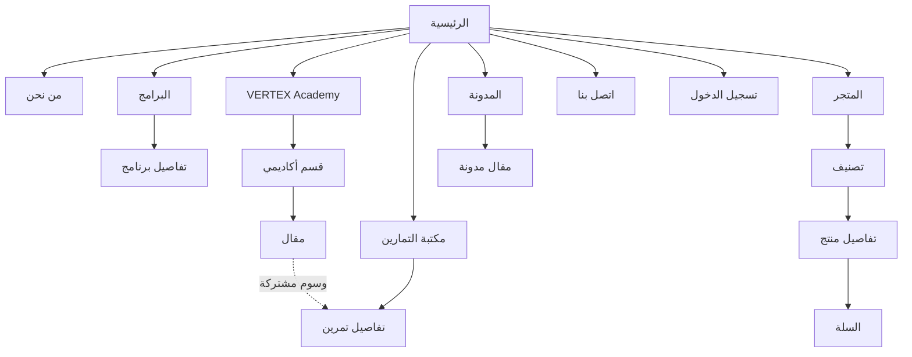
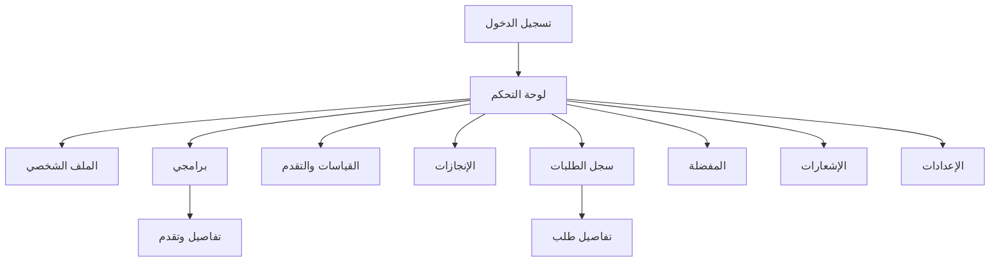

# Sitemap — VERTEXworkout
**المرحلة 4 من 18 — Information Architecture & SEO**
**الإصدار:** 1.0

---

## 1. مبادئ Information Architecture وSEO المتّبعة

- **URL نظيف ووصفي:** كل رابط يعكس محتواه بدون معرّفات غامضة، مثال: `/store/product/vertex-power-bag-15kg` وليس `/store/product?id=1234`.
- **snake-case ممنوع في الروابط، kebab-case فقط:** `exercise-library` وليس `exercise_library`.
- **بادئة اللغة إلزامية في كل رابط:** `/ar/...` و`/en/...` — لا توجد صفحة بدون تحديد لغة صريح في الرابط (أساسي لـ `hreflang` ولمنع Duplicate Content في نظر Google).
- **عمق لا يتجاوز 3 مستويات** من الصفحة الرئيسية لأي محتوى (Rule of Three Clicks) — كل محتوى يجب أن يكون قابلاً للوصول بأقل من 4 نقرات.
- **فصل النطاقات حسب مستوى الوصول** (متوافق مع قرار Monorepo في Project Structure): `admin` و`coach` تطبيقان منفصلان على نطاقات فرعية مستقلة — عزل أمني حقيقي، وليس فقط فصل بصري.
- **Breadcrumbs + Structured Data (BreadcrumbList)** في كل صفحة محتوى لتحسين ظهورها في نتائج البحث وتسهيل التنقل.

---

## 2. توزيع النطاقات (Domains) — متوافق مع قرار Monorepo

| النطاق | التطبيق | مستوى الوصول |
|---|---|---|
| `www.vertexworkout.com` | `apps/web` | Public + Auth + Client (حساب المتدرب جزء من نفس التطبيق) |
| `admin.vertexworkout.com` | `apps/admin` | Admin فقط (Phase 3) |
| `coach.vertexworkout.com` | `apps/coach` | Coach فقط (Phase 3) |

---

## 3. خريطة الموقع الكاملة (`apps/web`) — Phase 1

### أ. الصفحات العامة (Public) — Route Group: `(marketing)`

| الصفحة | الرابط (عربي) | الرابط (إنجليزي) | نوع الرابط |
|---|---|---|---|
| الرئيسية | `/ar` | `/en` | ثابت |
| من نحن | `/ar/about` | `/en/about` | ثابت |
| البرامج التدريبية | `/ar/programs` | `/en/programs` | ثابت |
| تفاصيل برنامج | `/ar/programs/[slug]` | `/en/programs/[slug]` | **ديناميكي** |
| VERTEX Academy | `/ar/academy` | `/en/academy` | ثابت |
| قسم أكاديمي | `/ar/academy/[category]` | `/en/academy/[category]` | **ديناميكي** (nutrition, anatomy, mobility, recovery, injury-prevention) |
| مقال أكاديمي | `/ar/academy/[category]/[slug]` | `/en/academy/[category]/[slug]` | **ديناميكي** |
| مكتبة التمارين | `/ar/exercise-library` | `/en/exercise-library` | ثابت (مع فلاتر عبر Query Params) |
| تفاصيل تمرين | `/ar/exercise-library/[slug]` | `/en/exercise-library/[slug]` | **ديناميكي** |
| المدونة | `/ar/blog` | `/en/blog` | ثابت |
| مقال مدونة | `/ar/blog/[slug]` | `/en/blog/[slug]` | **ديناميكي** |
| المتجر | `/ar/store` | `/en/store` | ثابت |
| تصنيف متجر | `/ar/store/category/[slug]` | `/en/store/category/[slug]` | **ديناميكي** |
| تفاصيل منتج | `/ar/store/product/[slug]` | `/en/store/product/[slug]` | **ديناميكي** |
| اتصل بنا | `/ar/contact` | `/en/contact` | ثابت |
| سياسة الخصوصية | `/ar/privacy-policy` | `/en/privacy-policy` | ثابت |
| شروط الاستخدام | `/ar/terms-of-service` | `/en/terms-of-service` | ثابت |
| سياسة الكوكيز | `/ar/cookies-policy` | `/en/cookies-policy` | ثابت |

### ب. صفحات المصادقة (Auth) — Route Group: `(auth)`

| الصفحة | الرابط |
|---|---|
| تسجيل الدخول | `/[locale]/login` |
| إنشاء حساب | `/[locale]/register` |
| نسيت كلمة المرور | `/[locale]/forgot-password` |
| إعادة تعيين كلمة المرور | `/[locale]/reset-password` |
| تأكيد البريد الإلكتروني | `/[locale]/verify-email` |

### ج. لوحة تحكم المتدرب (Client) — Route Group: `(client)` — محمية بـ Middleware

| الصفحة | الرابط |
|---|---|
| الرئيسية (ملخص التقدم) | `/[locale]/dashboard` |
| الملف الشخصي | `/[locale]/dashboard/profile` |
| برامجي | `/[locale]/dashboard/programs` |
| تفاصيل برنامج مشترك فيه | `/[locale]/dashboard/programs/[id]` **(ديناميكي)** |
| تتبع التقدم والقياسات | `/[locale]/dashboard/progress` |
| الإنجازات | `/[locale]/dashboard/achievements` |
| سجل الطلبات | `/[locale]/dashboard/orders` |
| تفاصيل طلب | `/[locale]/dashboard/orders/[id]` **(ديناميكي)** |
| المفضلة | `/[locale]/dashboard/wishlist` |
| الإشعارات | `/[locale]/dashboard/notifications` |
| الإعدادات | `/[locale]/dashboard/settings` |

### د. سلة التسوق والدفع (Checkout Flow) — Route Group: `(checkout)`

| الصفحة | الرابط |
|---|---|
| سلة التسوق | `/[locale]/cart` |
| صفحة الدفع | `/[locale]/checkout` |
| تأكيد الطلب (نجاح) | `/[locale]/checkout/success` |
| فشل الدفع | `/[locale]/checkout/failed` |

---

## 4. لوحة تحكم المدرب (`apps/coach`) — Phase 3، نطاق منفصل

| الصفحة | الرابط |
|---|---|
| الرئيسية | `coach.vertexworkout.com/[locale]/dashboard` |
| قائمة العملاء | `coach.vertexworkout.com/[locale]/clients` |
| تفاصيل عميل | `coach.vertexworkout.com/[locale]/clients/[id]` **(ديناميكي)** |
| إدارة البرامج | `coach.vertexworkout.com/[locale]/programs` |
| الحجوزات | `coach.vertexworkout.com/[locale]/bookings` |

## 5. لوحة تحكم الأدمن (`apps/admin`) — Phase 3، نطاق منفصل

| الصفحة | الرابط |
|---|---|
| الرئيسية | `admin.vertexworkout.com/[locale]/dashboard` |
| إدارة المستخدمين والأدوار | `admin.vertexworkout.com/[locale]/users` |
| إدارة المنتجات | `admin.vertexworkout.com/[locale]/products` |
| إدارة الطلبات | `admin.vertexworkout.com/[locale]/orders` |
| إدارة البرامج والتمارين | `admin.vertexworkout.com/[locale]/programs` |
| إدارة المحتوى (Academy/Blog) | `admin.vertexworkout.com/[locale]/content` |
| التقارير | `admin.vertexworkout.com/[locale]/reports` |
| سجلات التدقيق | `admin.vertexworkout.com/[locale]/audit-logs` |

---

## 6. صفحات النظام (System Pages)

| الصفحة | الرابط | ملاحظة |
|---|---|---|
| 404 - غير موجودة | `not-found.tsx` (خاص بـ Next.js، يُعرض تلقائيًا) | يجب أن يقترح روابط بديلة (الرئيسية، المتجر، البحث) وليس صفحة فارغة |
| 403 - غير مصرح | `/[locale]/forbidden` | يظهر عند فشل RBAC، مع رابط "العودة للوحة تحكمي" |
| 500 - خطأ خادم | `error.tsx` (Next.js Error Boundary) | رسالة عامة غير تقنية + رقم مرجعي للدعم الفني |
| وضع الصيانة | Middleware-level redirect عند تفعيل `MAINTENANCE_MODE` env variable | صفحة ثابتة بسيطة بدون أي استعلامات لقاعدة البيانات |

---

## 7. ملفات SEO الجذرية (Root-level)

| الملف | الغرض |
|---|---|
| `/sitemap.xml` | يُولَّد ديناميكيًا (Next.js `generateSitemaps`) — يشمل كل الصفحات الثابتة + الديناميكية (منتجات، برامج، مقالات) بكلتا اللغتين مع `hreflang` |
| `/robots.txt` | يسمح بفهرسة الصفحات العامة، ويمنع فهرسة `/dashboard`, `/checkout`, `/cart` |
| Metadata ديناميكي | كل صفحة ديناميكية (منتج، مقال، تمرين) تولّد `<title>`, `meta description`, `Open Graph`, `Twitter Card` تلقائيًا من بيانات `_translations` الخاصة بها |
| `hreflang` tags | في كل صفحة، وسم يربط النسخة العربية بالإنجليزية من نفس الصفحة لمنع اعتبارها محتوى مكرر |

---

## 8. مخطط علاقات الصفحات (Site Navigation Graph)

### أ. المنطقة العامة (Public)


### ب. لوحة تحكم المتدرب (Client Dashboard)


---

## 9. تفصيل Route Groups في Next.js App Router

```
apps/web/src/app/[locale]/
├── (marketing)/          # عام — لا يتطلب تسجيل دخول
│   ├── page.tsx
│   ├── about/
│   ├── programs/
│   ├── academy/
│   ├── exercise-library/
│   ├── blog/
│   ├── store/
│   ├── contact/
│   ├── privacy-policy/
│   ├── terms-of-service/
│   └── cookies-policy/
│
├── (auth)/                # صفحات المصادقة — تُعيد توجيه المستخدم المسجّل بالفعل
│   ├── login/
│   ├── register/
│   ├── forgot-password/
│   ├── reset-password/
│   └── verify-email/
│
├── (client)/               # محمية — تتطلب تسجيل دخول + دور Client
│   └── dashboard/
│       ├── page.tsx
│       ├── profile/
│       ├── programs/
│       ├── progress/
│       ├── achievements/
│       ├── orders/
│       ├── wishlist/
│       ├── notifications/
│       └── settings/
│
├── (checkout)/             # قد تكون Guest أو Client
│   ├── cart/
│   └── checkout/
│       ├── page.tsx
│       ├── success/
│       └── failed/
│
├── forbidden/              # 403
├── not-found.tsx           # 404
├── error.tsx               # 500
└── layout.tsx
```

**لماذا Route Groups بالأقواس `()`؟** تسمح بتطبيق `layout.tsx` مختلف لكل مجموعة (مثلاً `(client)` له Sidebar خاص بلوحة التحكم، بينما `(marketing)` له Header/Footer عام) **دون** أن تظهر أسماء المجموعات في الرابط النهائي — الرابط يبقى نظيفًا (`/dashboard` وليس `/(client)/dashboard`).

---

## ✅ يرجى المراجعة والموافقة على:
- [ ] توزيع النطاقات الثلاثة (web / admin / coach)
- [ ] بنية الروابط الكاملة لكل الصفحات العامة والمحمية
- [ ] الصفحات الديناميكية المحددة
- [ ] صفحات النظام (404/403/500/Maintenance) والقانونية
- [ ] استراتيجية SEO (sitemap.xml, robots.txt, hreflang, Metadata)
- [ ] تنظيم Route Groups داخل `apps/web`

بعد الموافقة، ننتقل مباشرة إلى **المرحلة 5: Wireframes (Desktop + Tablet + Mobile)**.
